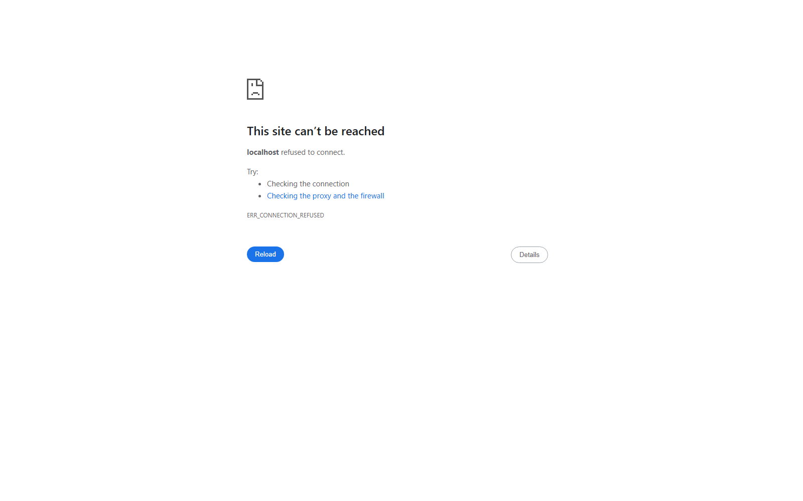

# Kanboard

[](https://nextjs.org/)
[](https://react.dev/)
[](https://www.typescriptlang.org/)
[](./LICENSE)

Kanboard es una app de Kanban construida con Next.js para seguir proyectos de GitHub con una interfaz tipo Bento, foco editorial y una base lista para automatizaciones de agente.



## Qué hace hoy

- tablero con columnas `Backlog`, `In Progress`, `On Hold` y `Done`
- vista `Projects`, `Tasks` y `Calendar`
- creación de tarjetas desde la UI
- edición de tarjetas existentes
- movimiento persistente entre columnas
- toggle de tareas desde el front
- paneles de `Notifications`, `Settings` y `Profile`
- persistencia local en `data/board.json`
- endpoints para updates externos y edición de proyectos

## Stack

- Next.js 16
- React 19
- TypeScript
- Tailwind CSS 4
- App Router

## Rutas API

- `GET /api/board`
- `POST /api/agent-updates`
- `PATCH /api/projects/[id]`

## Correr en local

En PowerShell conviene usar `npm.cmd`:

```bash
npm.cmd install
npm.cmd run dev
```

App local:

- `http://localhost:3000`

## Variables de entorno

Creá `.env.local` a partir de `.env.example`.

```bash
AGENT_SHARED_TOKEN=define-un-token-compartido
GITHUB_TOKEN=ghp_coloca_aqui_tu_token
```

## Deploy

### Opción 1: Vercel

1. Importá el repo en Vercel.
2. Configurá las variables de entorno.
3. Deploy automático sobre `main`.

### Opción 2: Node tradicional

```bash
npm.cmd install
npm.cmd run build
npm.cmd run start
```

## Estructura

```text
src/
  app/
    api/
      agent-updates/
      board/
      projects/[id]/
    page.tsx
  components/
    board-app.tsx
  lib/
    board-store.ts
    types.ts
data/
  board.json
docs/
  design-memory.md
  screenshots/
```

## Diseño

La memoria visual del proyecto está en:

- `docs/design-memory.md`

Esa guía define la dirección “Chromatic Curator” y funciona como source of truth para el front.

## Roadmap

- drag and drop con feedback visual más pulido
- autenticación real
- sincronización con issues, PRs y commits de GitHub
- persistencia en SQLite o Postgres
- CLI dedicada para publicar updates del agente

## Contribuir

Si querés colaborar, mirá [CONTRIBUTING.md](./CONTRIBUTING.md).
